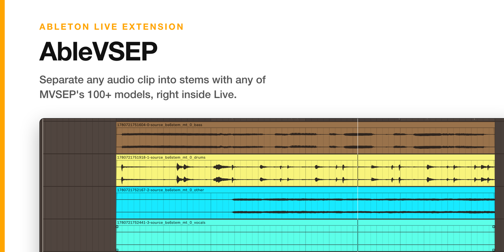
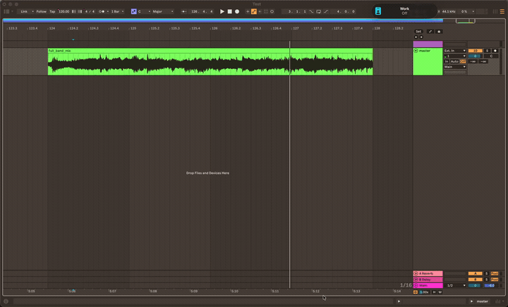
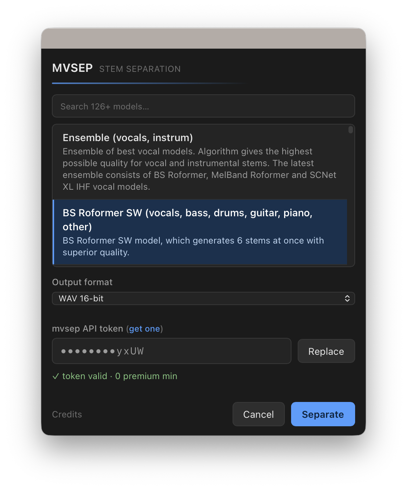

# AbleVSEP

[](https://github.com/madisonrickert/ablevsep/actions/workflows/ci.yml)

Right-click an audio clip in Ableton Live → **Separate Stems with MVSEP** → pick any
[mvsep.com](https://mvsep.com) model → the stems come back as new, group-styled tracks.
It mirrors Live's built-in Stem Separation workflow, but exposes mvsep's full model
catalog (126+ models) instead of one fixed algorithm.

> **Unofficial.** AbleVSEP is **not affiliated with, endorsed by, or sponsored by Ableton or MVSEP**.



## Features

- Separate an **Arrangement audio clip** or a **Session clip slot** into stems.
- Choose **any** mvsep model from a searchable picker, with that model's variant options.
- Stems land as new adjacent tracks named `<clip> - <stem>`, each in its own track color
  for easy visual separation, with the original muted (press ⌘G to fold them into a group).

## How it works

The extension renders/reads the clip's audio, uploads it to mvsep's separation API with
your chosen model, polls until the job finishes, downloads the stems, and places them back
into your set.



## Install

Download the latest **`.ablx`** from the
[**Releases** page](https://github.com/madisonrickert/ablevsep/releases/latest) (or build
one, see [Build from source](#build-from-source)), then:

1. In Ableton Live, open **Preferences → Extensions** (with Developer Mode **off**, so Live
   manages the extension).
2. Drag the `.ablx` onto that page.
3. Right-click an audio clip → **Separate Stems with MVSEP**.

## Usage

1. Right-click an **audio clip** (Arrangement) or a **Session clip slot** → **Separate Stems with MVSEP**.
2. Search/select a model, set its options + output format, paste your mvsep API token
   (optionally "remember as default"), click **Separate**.
3. Stems arrive as new tracks named `<clip> - <stem>`, each in its own track color, with
   the original muted.
4. **To group them:** select the new tracks and press **⌘G** (Live's extension API can't
   create a group track programmatically).



## Requirements

**To install and use**:

- **Ableton Live Suite 12.4.5+ with Extensions enabled** (tested on Ableton Beta 12.4.5b3). The `.ablx` is self-contained and runs inside Live's Extension Host.
- An **mvsep API token**, see <https://mvsep.com/full_api>.

**To build from source** (development only):

- **Node.js ≥ 24**.
- The **Ableton Extensions SDK (beta)**, distributed by Ableton and **not** included in
  this repository (see below).

## Build from source

This project depends on the Ableton Extensions SDK, which is not published to npm and is
not bundled here. Obtain it from Ableton, then:

1. Download and unpack the Extensions SDK (e.g. `extensions-sdk-1.0.0-beta.0`).
2. Tell the project where it is and install:
   ```bash
   cp .env.example .env
   # set ABLETON_SDK_PATH to your unpacked SDK, e.g. /path/to/extensions-sdk-1.0.0-beta.0
   npm run setup
   ```
   `npm run setup` copies the SDK tarballs into `./vendor/` (git-ignored) and installs all
   dependencies. Set the path once and you never edit `package.json`.

## Develop

The fastest loop uses Live's Developer Mode and an externally-launched Extension Host:

1. In your `.env`, set **`EXTENSION_HOST_PATH`** to your Live app, pointed at the Beta for
   live iteration, e.g. `/Applications/Ableton Live 12 Beta.app`.
2. In Live: **Preferences → Extensions → enable Developer Mode** (Live releases its managed
   host so the externally-launched one can connect).
3. Build and launch the host (leave it running):
   ```bash
   npm start
   ```
   `npm start` builds in dev mode and runs `extensions-cli run`, pointing storage/temp at
   `./.dev/` (git-ignored) so your token and catalog cache persist between runs.
4. Right-click an audio clip → **Separate Stems with MVSEP**.

## Build & package

```bash
npm run build               # production bundle → dist/extension.js
npm run package             # build + package the installable → release/<name>-<version>.ablx
npm run package -- --reveal # same, then reveal the .ablx in Finder (macOS)
```

`npm run package` writes the installable to `release/` (git-ignored), clearing any older
`.ablx` first so there's only ever the current one. Install it by dropping the `.ablx` onto
Live's **Extensions** preferences (with Developer Mode **off**).

## Test

```bash
npm test           # unit tests (Vitest) for the SDK-independent modules
npm run typecheck  # type-check the extension
```

## Behavior & limitations

- **Arrangement clips** render exactly what the clip plays (pre-FX, trimmed, warped) and
  place stems 1:1 at the original position. Faithful to Live's built-in stem separation.
- **Session clips** separate the clip's **source file** (no arrangement render is
  available). Unwarped clips get their region mirrored onto the stems; **warped Session
  clips are best-effort**: the placed region may not match what the clip played (surfaced
  in-app).
- Stems are placed **unwarped** (the Live API can't author warp markers), so they won't
  re-stretch if you change the project tempo later.
- No true Live **group** track (the SDK has no group-creation API), hence the ⌘G hint.
- Non-premium mvsep accounts allow **one job at a time**; v1 separates one clip per run.
